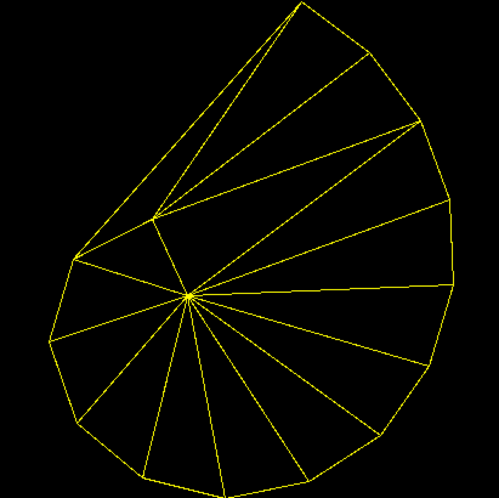

# Delaunay-Triangulation-Project

## Usage

This project implements the **Incremental Insertion** algorithm for Delaunay Triangulation.



### System Specifications
* **CPU:** Intel i9 (8 cores)
* **Language:** Python 3.x

### Command Line Arguments

| Flag | Category | Description |
| :--- | :--- | :--- |
| `--fast` | **Speed** | Runs the History DAG. |
| `--slow` | **Speed** | Runs the walking algorithm. |
| `--randomized` | **Run Type** | Randomizes input order to maintain $O(n \log n)$ efficiency. |
| `--ordered` | **Run Type** | Processes nodes in the original file order. |

---

### How to Run

Execute the script by passing the node file followed by your desired speed and run type flags:

```bash
python main.py <file_path>.node [speed] [run_type]
